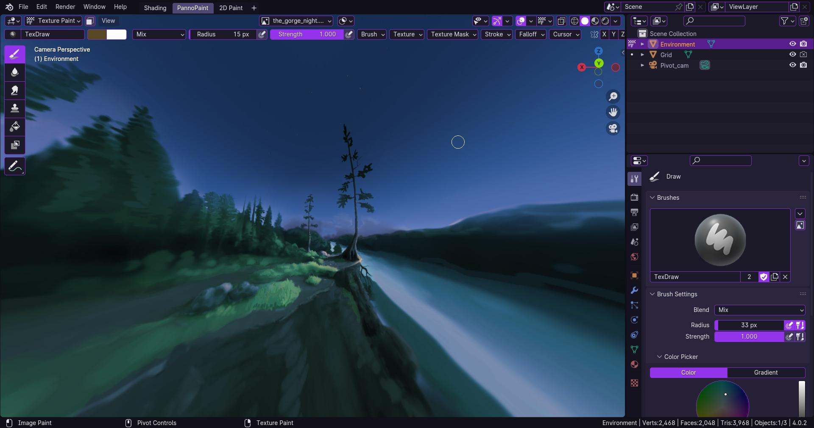

# PannoPaint

A work in progress Application Template for blender designed to make painting environment textures easier.

The template provides the custom operator `view3d.pivot` which replaces the `view3d.rotate` operator and removes panning shortcuts while providing texture ready geometry.

This allows navigation using the middle mouse button to have that google street view feel which is analogous to the way 2D artists pan in 2D software.

Blender does not yet provide an adequate method of manipulating the viewport zoom and orientation via python so a camera is used instead, this means that if the navigation gizmo is used or trackpad navigation the view can become disaligned with the camera, so for now using the mmb to pivot will always snap the viewport back to camera mode.

Currently confirmed to work on blender 4.0 and 4.1

## Installation

To install pannopaint via zip file:

- Download the main repo of b3dpannopaint as a zip file

- Rename "b3dpannopaint-main.zip" file to "pannopaint.zip"

- Select "Install Application Template..." from the Blender menu

- Select "pannopaint.zip" from the file file selector.

alternatively the repo can be cloned directly into the [application template directory](https://docs.blender.org/manual/en/latest/advanced/app_templates.html#directory-layout)

## Todo

- Eliminate reliance on magic numbers.

- Use mouse coordinates projected onto 3D unit sphere instead of 2D mouse coordinates.

- Limit pitch rotation to stop at poles.

- Improve key remap. Does not currently handle all input methods (My only focus so far has been making mouse and drawing tablet work).

Theme based on [Amythyst by kame404](https://github.com/kame404/Blender-Themes)
